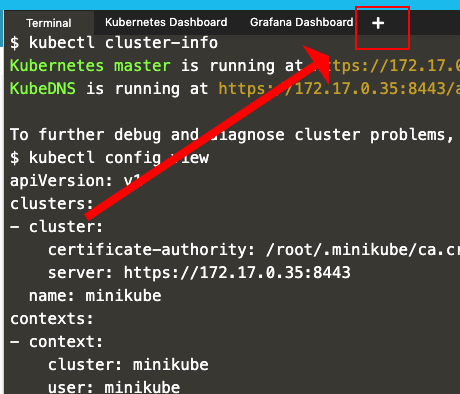
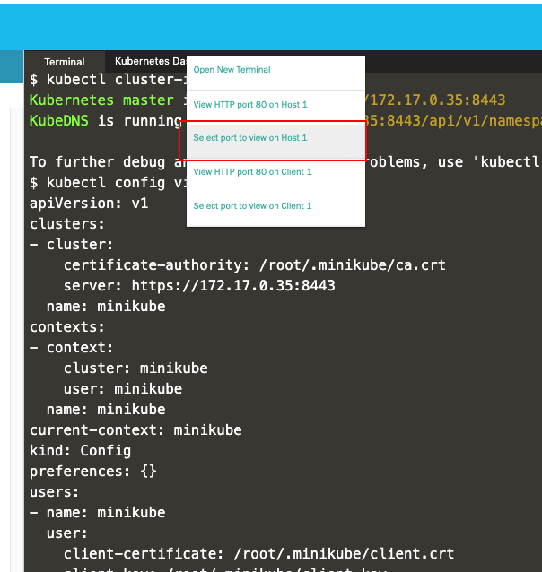
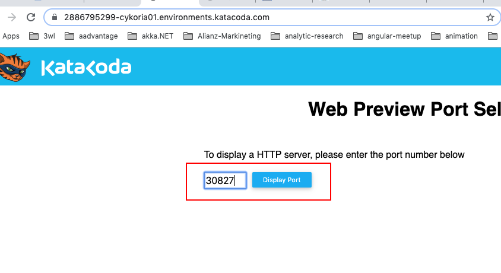
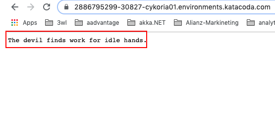

# Setting Up the Synchronous Version of the Fortune-Cookies MOA to Run Under Kubernetes

## (MOA = Microservices Oriented Architecture)

---- 

Before you start, please be advised that the MOA is running inside a Kubernetes cluster. The current state of the code is that the microservices are running
internal to Kubernetes. Hence, the application is faciliating internal "fortune sending" behavior. The next version will
implement an interface that makes the application accessible from outside the Kubernetes cluster.

---- 

**Step 1**: Go to a Minikube playground on Katacoda

(You might have to login or create an account)

`https://katacoda.com/javajon/courses/kubernetes-fundamentals/minikube`

**Step 2**: Load in this source code

`git clone https://github.com/reselbob/fortune-cookies.git`

**Step 3**: Navigate to the synchronous version of the MOA

`cd fortune-cookies/microservice-sync/`

**Step 4**: Run the shell script the creates a local Docker registry and seed the registry
with the containers representing each microservice 

`sh docker-seed.sh`

**Step 5**: Run the shell script that generates the pods and related services the make up
the MOA, Fortune-Cookies

`cd kubernetes`

`sh generate-k8s-resources.sh`

**Step 6**: Check out all went well by listing the pods and services

`kubectl get pods`

You should see output similar to the following:

```text
NAME        READY   STATUS    RESTARTS   AGE
email       1/1     Running   0          18s
facebook    1/1     Running   0          18s
fortunes    1/1     Running   0          15s
instagram   1/1     Running   0          18s
linkedin    1/1     Running   0          17s
scheduler   1/1     Running   0          16s
sender      1/1     Running   0          16s
sms         1/1     Running   0          17s
twitter     1/1     Running   0          17s
users       1/1     Running   0          16s
```

`kubectl get services`

You should see output similar to the following:

```text
NAME         TYPE        CLUSTER-IP       EXTERNAL-IP   PORT(S)   AGE
email        ClusterIP   10.97.47.100     <none>        80/TCP    92s
facebook     ClusterIP   10.107.216.185   <none>        80/TCP    92s
fortunes     ClusterIP   10.97.45.203     <none>        80/TCP    90s
instagram    ClusterIP   10.98.41.69      <none>        80/TCP    92s
kubernetes   ClusterIP   10.96.0.1        <none>        443/TCP   8m39s
linkedin     ClusterIP   10.104.201.201   <none>        80/TCP    91s
scheduler    ClusterIP   10.98.77.10      <none>        80/TCP    91s
sender       ClusterIP   10.109.110.42    <none>        80/TCP    91s
sms          ClusterIP   10.108.136.36    <none>        80/TCP    91s
twitter      ClusterIP   10.96.206.203    <none>        80/TCP    91s
users        ClusterIP   10.104.217.252   <none>        80/TCP    90s
```


**Step 7**: Wait about 10 seconds for the MOA to warm up and then check the logs of some
target pods

`kubectl logs sms`

You should see output similar to the following:

```text
SMS is sending a POST at Sun Aug 04 2019 17:04:33 GMT+0000 (UTC) with the body {"fortune":"Take care of the pence and the pounds will take care of themselves."}.
SMS is sending a POST at Sun Aug 04 2019 17:04:33 GMT+0000 (UTC) with the body {"fortune":"Necessity is a hard nurse, but she raisesstrong children."}.
SMS is sending a POST at Sun Aug 04 2019 17:04:33 GMT+0000 (UTC) with the body {"fortune":"No news is good news."}.
SMS is sending a POST at Sun Aug 04 2019 17:04:33 GMT+0000 (UTC) with the body {"fortune":"You're never too old to learn."}.
SMS is sending a POST at Sun Aug 04 2019 17:04:33 GMT+0000 (UTC) with the body {"fortune":"It never rains but it pours."}.
SMS is sending a POST at Sun Aug 04 2019 17:04:33 GMT+0000 (UTC) with the body {"fortune":"See nothing, say nothing, know nothing."}.
SMS is sending a POST at Sun Aug 04 2019 17:04:33 GMT+0000 (UTC) with the body {"fortune":"Everyone has a photographic memory, some just don't have film."}.
SMS is sending a POST at Sun Aug 04 2019 17:04:33 GMT+0000 (UTC) with the body {"fortune":"What do you expect from a pig, but a grunt?"}.
SMS is sending a POST at Sun Aug 04 2019 17:04:33 GMT+0000 (UTC) with the body {"fortune":"Honesty is the best policy."}.
```

`kubectl logs twitter`

You should see output similar to the following:

```text
TWITTER is sending a POST at Sun Aug 04 2019 17:05:20 GMT+0000 (UTC) with the body {"fortune":"Flattery is all right so long as you don't inhale."}.
TWITTER is sending a POST at Sun Aug 04 2019 17:05:21 GMT+0000 (UTC) with the body {"fortune":"The more you stir, the more it stinks."}.
TWITTER is sending a POST at Sun Aug 04 2019 17:05:22 GMT+0000 (UTC) with the body {"fortune":"If you lose your temper, don't look for it."}.
TWITTER is sending a POST at Sun Aug 04 2019 17:05:23 GMT+0000 (UTC) with the body {"fortune":"As you sow, so shall you reap."}.
TWITTER is sending a POST at Sun Aug 04 2019 17:05:24 GMT+0000 (UTC) with the body {"fortune":"The geek shall inherit the earth."}.
TWITTER is sending a POST at Sun Aug 04 2019 17:05:25 GMT+0000 (UTC) with the body {"fortune":"Procrastination is the thief of time."}.
```

`kubectl logs facebook`

You should see output similar to the following:

```text
FACEBOOK is sending a POST at Sun Aug 04 2019 17:05:45 GMT+0000 (UTC) with the body {"fortune":"He who fights and runs away, lives to fight another day."}.
FACEBOOK is sending a POST at Sun Aug 04 2019 17:05:46 GMT+0000 (UTC) with the body {"fortune":"A short cut is often a wrong cut."}.
FACEBOOK is sending a POST at Sun Aug 04 2019 17:05:47 GMT+0000 (UTC) with the body {"fortune":"You can't tell a book by its cover."}.
FACEBOOK is sending a POST at Sun Aug 04 2019 17:05:48 GMT+0000 (UTC) with the body {"fortune":"A drowning man will clutch at a straw."}.
FACEBOOK is sending a POST at Sun Aug 04 2019 17:05:49 GMT+0000 (UTC) with the body {"fortune":"No life can be dreary when work is adelight."}.
FACEBOOK is sending a POST at Sun Aug 04 2019 17:05:50 GMT+0000 (UTC) with the body {"fortune":"You can't live on bread alone."}.
```
**Step 8**: Let's use the test consumer to access the Fortunes service.

First we need to add the TestConsumer pod and service to the cluster.

Let's do the pod:

`kubectl apply -f manifests/testconsumer-pod.yaml`

You'll get the following output:

`pod/testconsumer created`

and then the service:

`kubectl apply -f manifests/testconsumer-service.yaml`

You'll get the following output:

`service/testconsumer created`

**Step 9**: Check to make sure that the pod and service are up and running:
`kubectl get all | grep testconsumer`

You' get output similar to the following:

```text
pod/testconsumer       1/1         Running             0                         87s
service/testconsumer   NodePort    10.102.23.152    <none>        80:30827/TCP   29s
```
Notice that in this case the NodePort `testconsumer` service is `30827`. You'll probably get a different
port number, but the important thing to remember is that the NodePort port will be a number over 30000.

**Step 10:** Let's get the IP address of the Master, this will allow us to access the `testconsumer` via the NodePort.

`kubectl cluster-info`

You'll get output similar to the following:

```text
Kubernetes master is running at https://172.17.0.35:8443
KubeDNS is running at https://172.17.0.35:8443/api/v1/namespaces/kube-system/services/kube-dns:dns/proxy
```
In this case, the IP address of the Master is `172.17.0.35`.

**Step 11:** Let's `curl` against the Master IP and the NodePort

`curl 172.17.0.35:30827`

You'll get a fortune as the output, like so:

`The best things come in small packages`

***Accessing the `testconsumer` using the via KataCoda HTTP.***

Katacoda has a feature that allow you to access a port that exposed from the cluster via HTTP. The following 
illustrations show you how to bring up the web page, enter the NodePort IP and see the output.

**Step 1:** Click the (`+`) sign at the top of the Katacoda terminal window as shown in the figure below:



**Step 2:** Click, `Select port to view on Host 1` as shown in the figure below.



**Step 3:** You will be taken to a web page into which you will enter the NodePort in a small text box as shown in the
figure below:



**Step 4:** At this point you'll be bound to the Node.js web server that backing the `testconsumer` service. Just refresh
the web page to get a new fortune.

